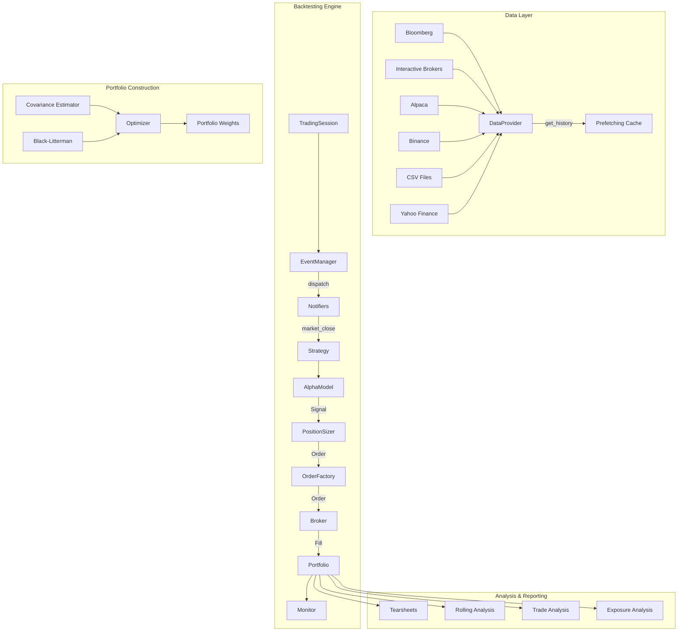
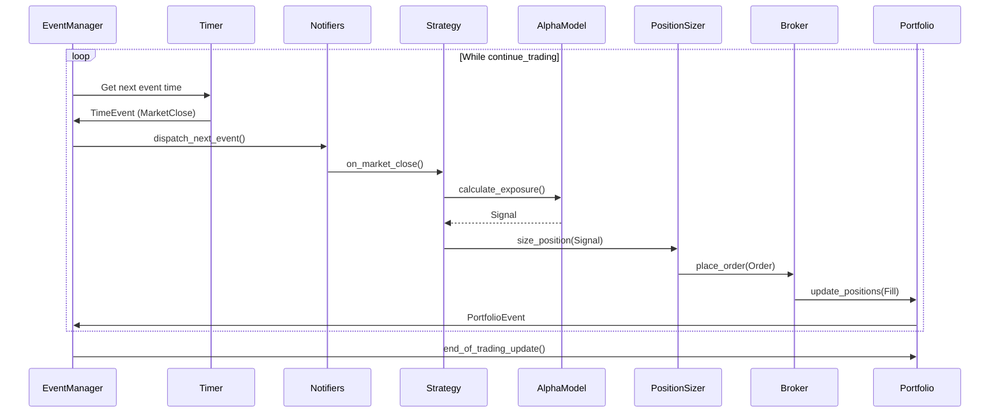
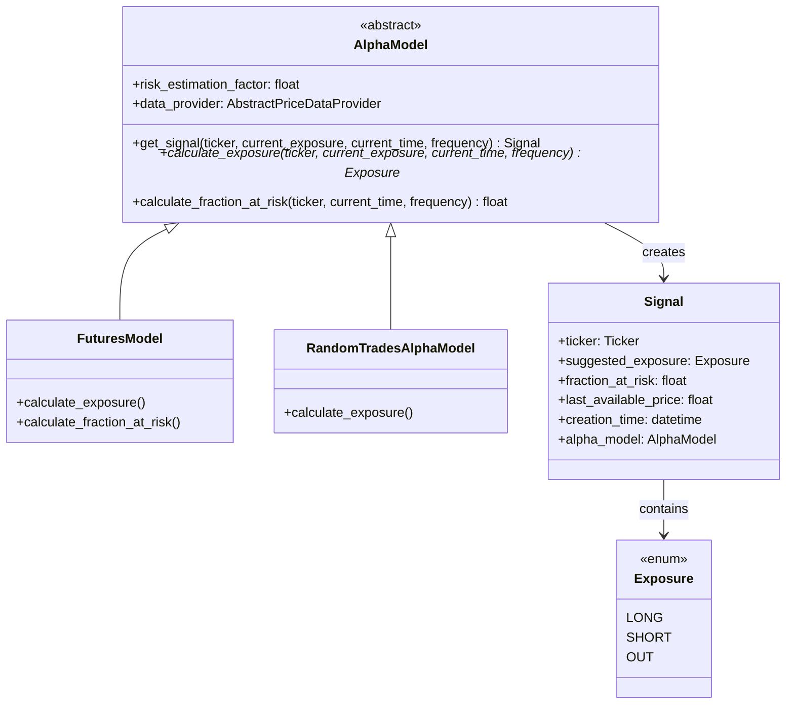
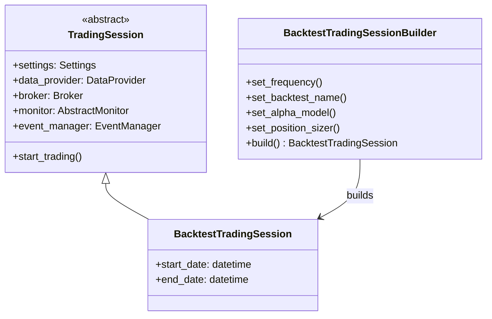
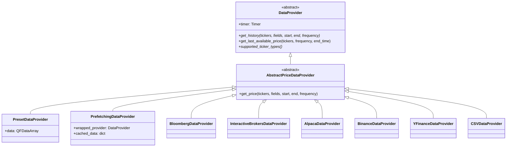
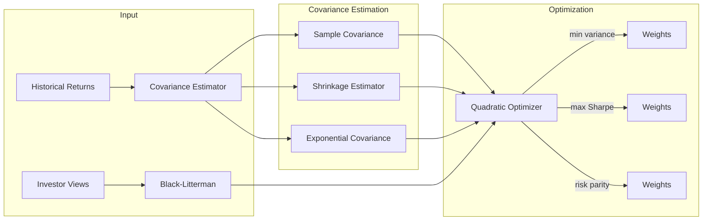

# QF-Lib Architecture

## System Architecture Overview

QF-Lib follows an event-driven architecture for backtesting, with clean separation between data provision, signal generation, order management, and execution. The design supports both backtesting and live trading through common interfaces.

## Trading Paradigm & Key Features

| Feature | Support | Details |
|---------|---------|---------|
| Backtesting Approach | Event-driven | Full event loop with broker emulation, order management, and position tracking |
| Live Trading | Yes | Same TradingSession interface with live data providers and brokers |
| Paper Trading | Yes | Simulated broker with realistic order execution for paper trading |
| Multi-Asset | Yes | Equities, futures, crypto, and more via abstract Ticker/Contract system |
| Data Feeds | Multiple providers | Bloomberg (BLPAPI, BEAP, DL), Interactive Brokers, Alpaca, Binance, Quandl, Yahoo Finance, CSV |
| ML Integration | No | No built-in ML; alpha models are rule-based with exposure signals (LONG/SHORT/OUT) |
| Risk Management | Built-in | Position sizing, stop-loss support, fraction-at-risk estimation, exposure analysis |
| Optimization | No | No built-in hyperparameter optimization; FastAlphaModelTester for rapid signal evaluation |
| Execution | Both | Simulated broker for backtesting; live via Interactive Brokers, Alpaca, Binance |

## Event-Driven Architecture

The core of QF-Lib is an event loop managed by `EventManager`:

## Class Hierarchy

### Alpha Model Framework

### Trading Session Builder Pattern

### Data Provider Abstraction

## Portfolio Construction Architecture

## Custom Container Types

QF-Lib provides typed containers that extend pandas:

| Container | Base | Purpose |
|-----------|------|---------|
| `QFSeries` | `pd.Series` | General financial time series |
| `QFDataFrame` | `pd.DataFrame` | Multi-column financial data |
| `QFDataArray` | `xarray.DataArray`-like | 3D data (date x ticker x field) |
| `PricesSeries` | `QFSeries` | Price data with domain validation |
| `ReturnsSeries` | `QFSeries` | Returns data |
| `LogReturnsSeries` | `QFSeries` | Log returns |
| `SimpleReturnsSeries` | `QFSeries` | Simple returns |

## Key Architectural Decisions

1. **Event-driven over vectorized**: The backtesting engine is event-driven to accurately simulate real trading conditions including order latency, partial fills, and market impact.

2. **Builder pattern for sessions**: `BacktestTradingSessionBuilder` allows flexible configuration of backtests without complex constructor signatures.

3. **Abstract data provider**: A single interface across all data sources prevents vendor lock-in and simplifies strategy code.

4. **Look-ahead bias protection**: The `DataProvider.get_history()` method accepts a `look_ahead_bias` flag that, when False, ensures no future data leaks into the backtest.

5. **Timer abstraction**: `Timer` (with `RealTimer` and `SettableTimer` implementations) enables the same code to run in both backtest and live modes.

6. **Separation of alpha and sizing**: Alpha models produce exposure signals (LONG/SHORT/OUT), while position sizers translate these into concrete order sizes, enforcing separation of concerns.

---
## See Also
- [README](README.md) — Project overview and quick start
- [Workflow](workflow.md) — Event flows and processing pipelines
- [State Management](state-management.md) — State lifecycle and data models
- [Development](development.md) — Development guide and best practices
