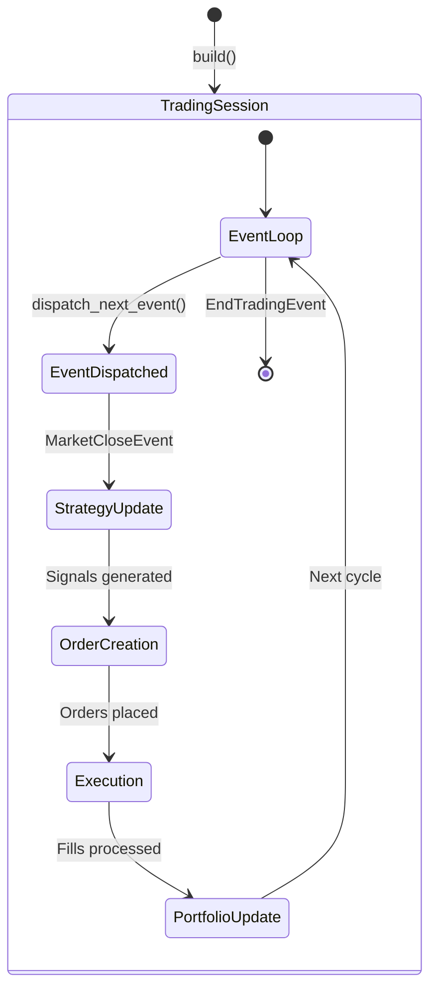
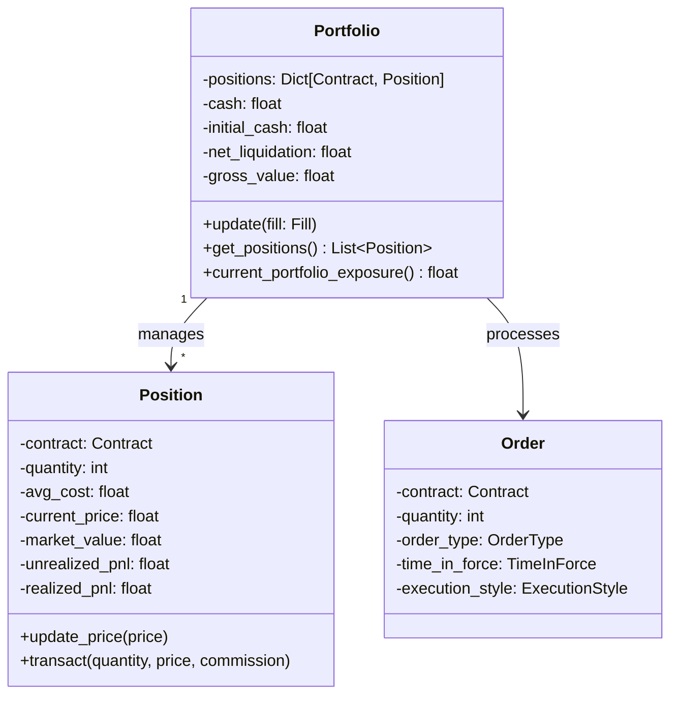
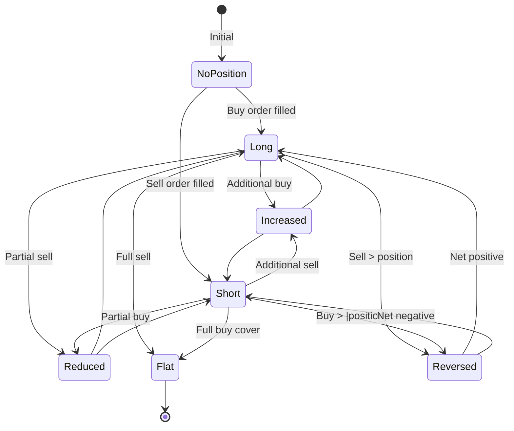
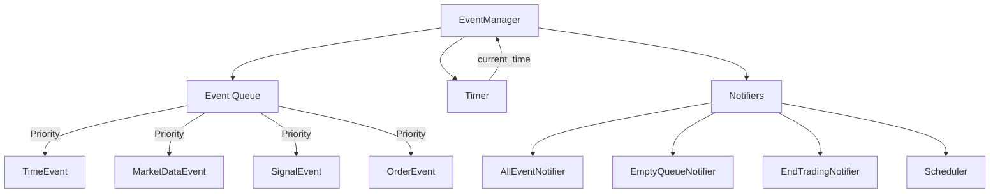
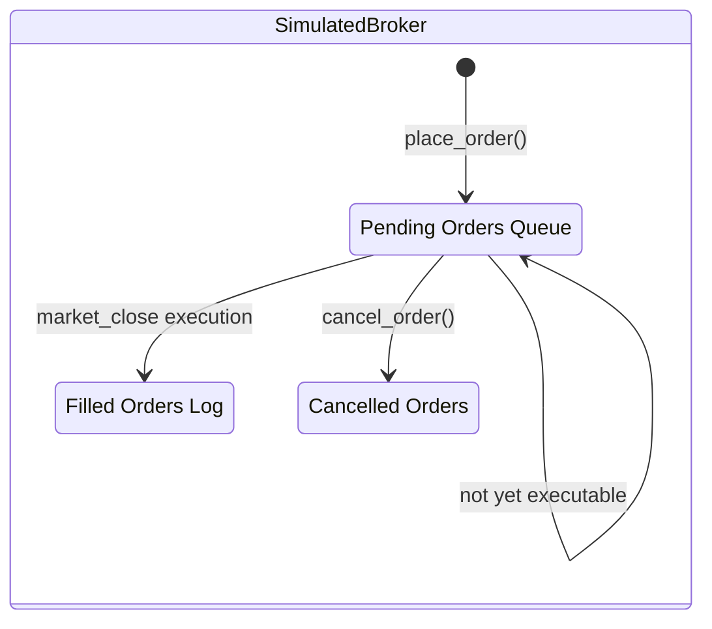

# QF-Lib State Management

## Overview

QF-Lib is an event-driven system with rich stateful components. The backtesting engine maintains a comprehensive state model representing portfolio positions, pending orders, market data, and event queues. Understanding this state model is critical for extending the framework.

## Core State Components



## Portfolio State

The `Portfolio` object is the central state container:



### Position Lifecycle



## Event Manager State

The `EventManager` orchestrates all state transitions:



### Event Types and Their State Effects

| Event | Source | State Modified |
|-------|--------|----------------|
| `MarketOpenEvent` | Scheduler | Timer advances |
| `MarketCloseEvent` | Scheduler | Triggers strategy evaluation |
| `EmptyQueueEvent` | EventManager | Advances to next time step |
| `EndTradingEvent` | Timer (end date) | Stops event loop |
| `OrderEvent` | Strategy | Adds to order queue |
| `FillEvent` | Broker | Updates portfolio positions |

## Timer State

Two implementations control time progression:

| Timer | Use Case | Behavior |
|-------|----------|----------|
| `SettableTimer` | Backtesting | Time advances on `EmptyQueueEvent` |
| `RealTimer` | Live trading | Returns system clock time |

```python
# Backtest: Timer is set by the event manager
timer.set_current_time(next_event_time)

# Live: Timer returns real time
current = timer.now()
```

## Data Provider State

### Caching Layer

`PrefetchingDataProvider` maintains a data cache:

```mermaid
flowchart LR
    REQUEST[get_history()] --> CACHE{In cache?}
    CACHE -->|Yes| RETURN[Return cached data]
    CACHE -->|No| FETCH[Fetch from wrapped provider]
    FETCH --> STORE[Store in cache]
    STORE --> RETURN
```

### Look-Ahead Bias Protection

The data provider enforces temporal ordering:

```python
# With look_ahead_bias=False (default):
# - Data returned is filtered to end_date <= current_time
# - Prevents future data from leaking into backtests
```

## Monitor State

The `AbstractMonitor` tracks performance metrics throughout the backtest:

- `portfolio_values` - Time series of portfolio NAV
- `positions_history` - Historical position snapshots
- `transactions` - Complete trade log
- `exposure_values` - Time series of gross/net exposure

## Broker State

### Simulated Broker

Maintains pending orders and simulates execution:



### Order Factory State

`OrderFactory` is stateless -- it creates orders based on current portfolio state and desired target positions. The factory queries the portfolio for current holdings to compute the delta required.

## Strategy State

`AlphaModelStrategy` maintains:
- `model_tickers_dict` - Mapping of alpha models to their ticker universes
- Previous signal state per ticker (for change detection)
- Stop-loss levels (if enabled)

## Settings (Global Configuration)

`Settings` object is loaded once and passed through the system:

```python
settings = Settings(
    output_directory="./output",
    data_directory="./data",
    # Database connections, API keys, etc.
)
```

Settings are immutable after initialization. All components receive them via constructor injection.

## State Persistence

QF-Lib does not persist backtest state between runs. Each backtest starts fresh. However:

- **Monitor output**: Can be serialized to files (PDF tearsheets, CSV exports)
- **Data caches**: `PrefetchingDataProvider` can be pre-warmed from files
- **Portfolio snapshots**: The monitor records full portfolio state at each time step for post-hoc analysis

## Thread Safety

QF-Lib backtests are single-threaded by design. The event loop processes events sequentially, ensuring deterministic execution. Data providers may use threading for I/O (e.g., Bloomberg API), but all state mutations happen on the main thread.

---
## See Also
- [README](README.md) — Project overview and quick start
- [Architecture](architecture.md) — System design and components
- [Workflow](workflow.md) — Event flows and processing pipelines
- [Development](development.md) — Development guide and best practices
