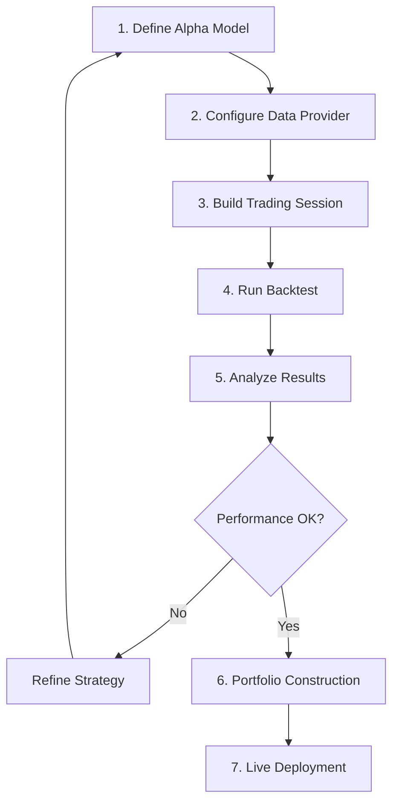
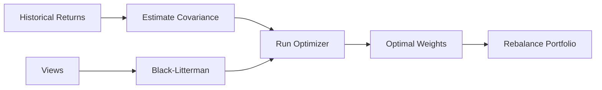

# QF-Lib Workflow

## Strategy Development Lifecycle



## 1. Implementing an Alpha Model

Create a subclass of `AlphaModel`:

```python
from qf_lib.backtesting.alpha_model.alpha_model import AlphaModel
from qf_lib.backtesting.alpha_model.exposure_enum import Exposure
from qf_lib.common.enums.frequency import Frequency
from qf_lib.common.enums.price_field import PriceField

class MovingAverageCrossover(AlphaModel):
    def __init__(self, fast_period, slow_period, data_provider):
        super().__init__(
            risk_estimation_factor=1.0,
            data_provider=data_provider
        )
        self.fast_period = fast_period
        self.slow_period = slow_period

    def calculate_exposure(self, ticker, current_exposure, current_time, frequency):
        # Fetch historical prices
        prices = self.data_provider.get_price(
            tickers=ticker,
            fields=PriceField.Close,
            start_date=current_time - RelativeDelta(months=6),
            end_date=current_time,
            frequency=frequency
        )

        fast_ma = prices.rolling(self.fast_period).mean()
        slow_ma = prices.rolling(self.slow_period).mean()

        if fast_ma.iloc[-1] > slow_ma.iloc[-1]:
            return Exposure.LONG
        elif fast_ma.iloc[-1] < slow_ma.iloc[-1]:
            return Exposure.SHORT
        return Exposure.OUT
```

## 2. Configuring Data Providers

```python
from qf_lib.data_providers.preset_data_provider import PresetDataProvider
from qf_lib.data_providers.prefetching_data_provider import PrefetchingDataProvider

# Option A: Preset data (for backtesting with known data)
data_provider = PresetDataProvider(
    data=historical_data_array,
    start_date=start_date,
    end_date=end_date,
    frequency=Frequency.DAILY
)

# Option B: Live data provider with caching
data_provider = PrefetchingDataProvider(
    wrapped_provider=bloomberg_dp,
    tickers=universe,
    fields=[PriceField.Open, PriceField.High, PriceField.Low, PriceField.Close],
    start_date=start_date,
    end_date=end_date
)
```

## 3. Building and Running a Backtest

```python
from qf_lib.backtesting.trading_session.backtest_trading_session_builder import BacktestTradingSessionBuilder
from qf_lib.backtesting.strategies.alpha_model_strategy import AlphaModelStrategy

# Build session
builder = BacktestTradingSessionBuilder(settings, data_provider)
builder.set_frequency(Frequency.DAILY)
builder.set_backtest_name("ma_crossover")
ts = builder.build()

# Create strategy
alpha_model = MovingAverageCrossover(20, 50, ts.data_provider)
strategy = AlphaModelStrategy(
    ts=ts,
    model_tickers_dict={alpha_model: universe},
    use_stop_losses=False
)

# Run backtest
ts.start_trading()
```

## 4. Event Loop Detail

```mermaid
sequenceDiagram
    participant Loop as Event Loop
    participant Sched as Scheduler
    participant Strat as Strategy
    participant AM as AlphaModel
    participant PS as PositionSizer
    participant Broker
    participant Port as Portfolio

    Loop->>Sched: next event?
    Sched->>Loop: MarketOpenEvent
    Loop->>Strat: on_market_open()

    Loop->>Sched: next event?
    Sched->>Loop: MarketCloseEvent
    Loop->>Strat: on_market_close()
    Strat->>AM: get_signal(ticker)
    AM-->>Strat: Signal(LONG, 0.02)

    Strat->>PS: size_positions(signals)
    PS-->>Strat: orders

    Strat->>Broker: place_orders(orders)
    Broker->>Port: execute_orders()
    Port->>Port: update_positions()

    Loop->>Sched: next event?
    Sched->>Loop: EndTradingEvent
    Loop->>Port: end_of_trading_update()
```

## 5. Analysis and Reporting

### Tearsheet Generation

```python
from qf_lib.analysis.tearsheets.tearsheet_comparative import TearsheetComparative

tearsheet = TearsheetComparative(
    settings=settings,
    pdf_exporter=pdf_exporter,
    strategy_series=strategy_returns,
    benchmark_series=benchmark_returns,
    title="MA Crossover Strategy"
)
tearsheet.build_document()
tearsheet.save()
```

### Available Analysis Modules

| Module | Purpose |
|--------|---------|
| `backtests_overfitting` | Detect strategy overfitting via minimum backtest length |
| `breakout_strength` | Measure trend strength and breakout quality |
| `exposure_analysis` | Analyze portfolio exposure over time |
| `rolling_analysis` | Rolling Sharpe, volatility, beta calculations |
| `signals_analysis` | Evaluate signal quality and decay |
| `strategy_monitoring` | Real-time strategy health checks |
| `tearsheets` | Comprehensive PDF strategy reports |
| `trade_analysis` | Trade-level P&L, win rates, holding periods |
| `timeseries_analysis` | Statistical properties of return series |

## 6. Portfolio Construction Workflow



```python
from qf_lib.portfolio_construction.optimizers.quadratic_optimizer import QuadraticOptimizer
from qf_lib.portfolio_construction.portfolio_models.min_variance_portfolio import MinVariancePortfolio

# Estimate covariance
from qf_lib.portfolio_construction.covariance_estimation.sample_covariance import SampleCovariance
cov_estimator = SampleCovariance()
cov_matrix = cov_estimator.estimate(returns)

# Optimize
optimizer = QuadraticOptimizer()
weights = optimizer.get_optimal_weights(
    P=cov_matrix,
    upper_constraints=0.20  # max 20% per asset
)
```

## 7. Live Trading

QF-Lib supports live trading through the same `TradingSession` interface:

1. Replace `BacktestTradingSession` with a live trading session
2. Use a live `DataProvider` (Bloomberg, IB, Alpaca)
3. Use a live `Broker` implementation
4. The `Timer` switches from `SettableTimer` to `RealTimer`
5. Strategy code remains unchanged

## Fast Alpha Model Testing

For rapid iteration on alpha models without full backtesting:

```python
from qf_lib.backtesting.fast_alpha_model_tester.fast_alpha_model_tester import FastAlphaModelTester

tester = FastAlphaModelTester(
    alpha_model=my_model,
    data_provider=data_provider,
    tickers=universe,
    start_date=start,
    end_date=end
)
results = tester.test_alpha_model()
```

This bypasses the full event loop and order management for faster feedback during development.

---
## See Also
- [README](README.md) — Project overview and quick start
- [Architecture](architecture.md) — System design and components
- [State Management](state-management.md) — State lifecycle and data models
- [Development](development.md) — Development guide and best practices
